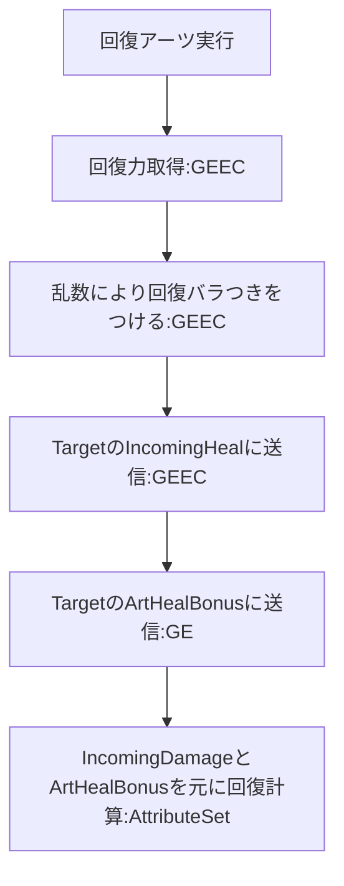

```mermaid
graph
    A[回復アーツ実行] --> B[回復力取得:GEEC]
    B --> C[乱数により回復バラつきをつける:GEEC]
    C --> D[TargetのIncomingHealに送信:GEEC]
    D --> E[TargetのArtHealBonusに送信:GE]
    E --> F[IncomingDamageとArtHealBonusを元に回復計算:AttributeSet]
```

