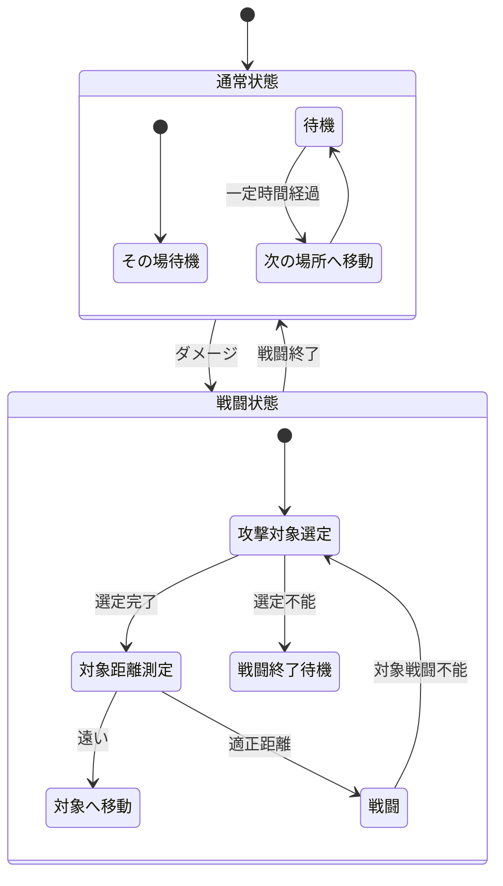
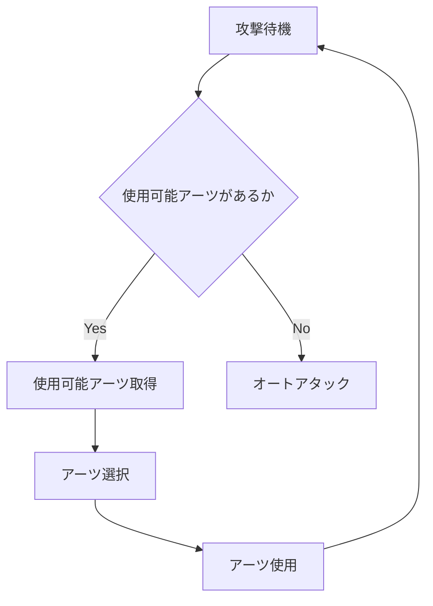

## 戦闘対象選定・移動の思考

```mermaid
stateDiagram-v2
    [*] --> 通常状態
    state 通常状態 {
        [*] --> その場待機
        待機 --> 次の場所へ移動: 一定時間経過
        次の場所へ移動 --> 待機
    }
    
    通常状態 --> 戦闘状態:　ダメージ
    戦闘状態　--> 通常状態: 戦闘終了
    
    state 戦闘状態　{
        [*] --> 攻撃対象選定
        攻撃対象選定 --> 対象距離測定: 選定完了
        攻撃対象選定 --> 戦闘終了待機: 選定不能
        
        対象距離測定 --> 対象へ移動: 遠い
        対象距離測定 --> 戦闘: 適正距離
        戦闘 --> 攻撃対象選定: 対象戦闘不能
    }
```
## 戦闘時の判断
- 攻撃は一定時間に一度判定を行う。
- オートアタックかアーツを放つ

```mermaid
graph
    F[攻撃待機] --> A
    A{使用可能アーツがあるか}
    A -- Yes --> B[使用可能アーツ取得]
    A -- No --> C[オートアタック]
    B --> D[アーツ選択]
    D --> E[アーツ使用]
    E --> F
```